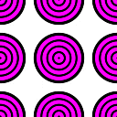
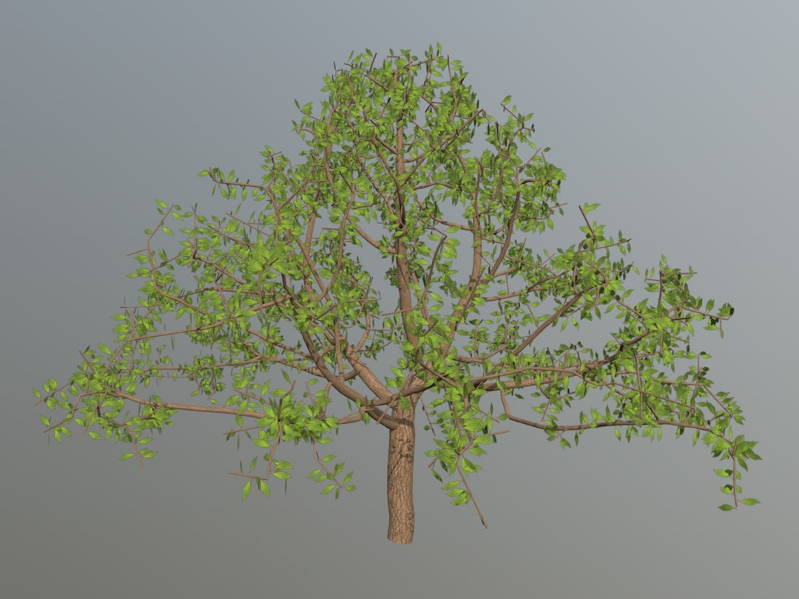

# Davide Sforza

Ph.D. Student in Computer Science at Sapienza University of Rome

## Current Projects

Rendering with Neural Lenses. In progress.

## Publications

Eduardo Rinaldi, **Davide Sforza**, and Fabio Pellacini. NodeGit: Diffing and Merging Node Graphs. In *ACM Transactions on Graphics*. 2023. DOI: [10.1145/3618343](https://doi.org/10.1145/3618343). Code: TBR   

**Davide Sforza** and Fabio Pellacini. Numerical approximations for energy preserving microfacet models. In *Computers & Graphics*. 2023. DOI: [10.1016/j.cag.2023.05.012](https://doi.org/10.1016/j.cag.2023.05.012).
  

**Davide Sforza** and Fabio Pellacini. Enforcing Energy Preservation in Microfacet Models. In *Smart Tools and Applications in Graphics - Eurographics Italian Chapter Conference*. 2022. DOI: [10.2312/stag.20221258](https://doi.org/10.2312/stag.20221258). Code: [github.com/dsforza96/energy-preservation](https://github.com/dsforza96/energy-preservation)

Marzia Riso, **Davide Sforza**, and Fabio Pellacini. pOp: Parameter Optimization of Differentiable Vector Patterns. In *Computer Graphics Forum*. 2022. DOI: [10.1111/cgf.14595](https://doi.org/10.1111/cgf.14595).
  

Maria De Marsico, Emanuele Panizzi, Francesca Romana Mattei, Antonio Musolino, Manuel Prandini, Marzia Riso, and **Davide Sforza**. Virtual bowling: launch as you all were there! In *Proceedings of the International Conference on Advanced Visual Interface*. 2020. DOI: [10.1145/3399715.3399848](https://doi.org/10.1145/3399715.3399848). Code: [github.com/antoniomuso/Bowling-VR](https://github.com/antoniomuso/Bowling-VR)

## Projects

**Yocto/Hair:** Tiny Path Tracer Extension to Shade Realistic-Looking Hair. \
[github.com/dsforza96/yocto-hair](https://github.com/dsforza96/yocto-hair)
  

**AtA-gpu:** A Strassen-based CUDA Implementation of AtA Matrix Multiplication. \
[github.com/dsforza96/AtA-gpu](https://github.com/dsforza96/AtA-gpu)

**Next!** A multimodal tool to remote control your presentations. \
[github.com/antoniomuso/Next](https://github.chttps://github.com/antoniomuso/Next)
  

**The Visual Microphone:** Passive Recovery of Sound from Video. \
[github.com/dsforza96/visual-mic](https://github.com/dsforza96/visual-mic)

**Tree-gen:** Generating Trees with a Space Colonization Algorithm. \
[github.com/dsforza96/tree-gen](https://github.com/dsforza96/tree-gen)
